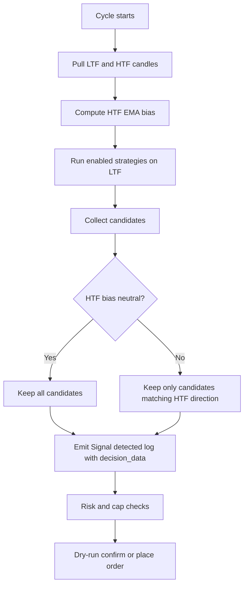
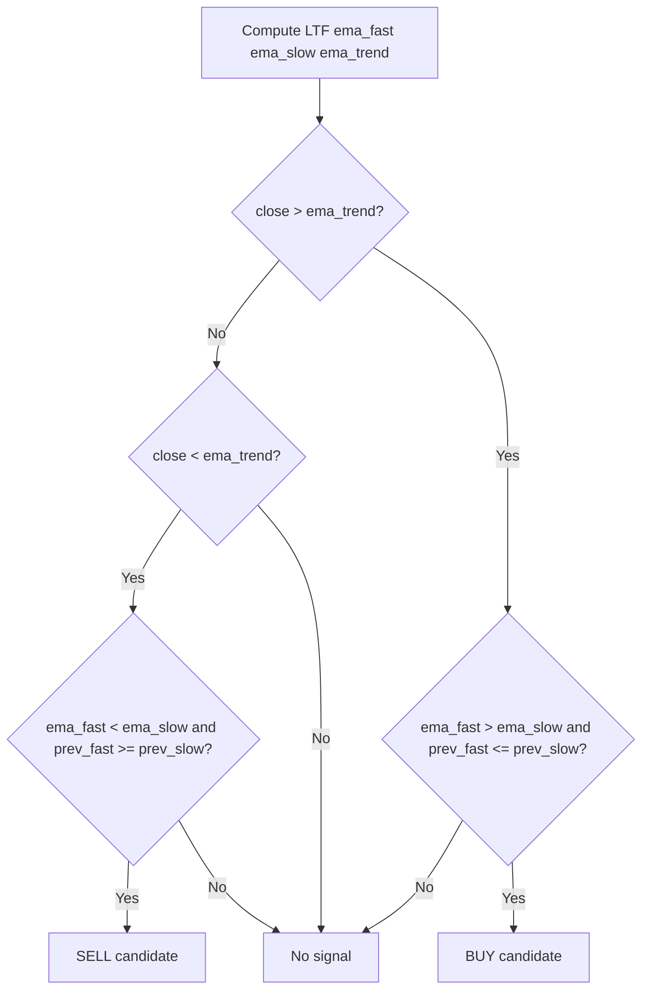
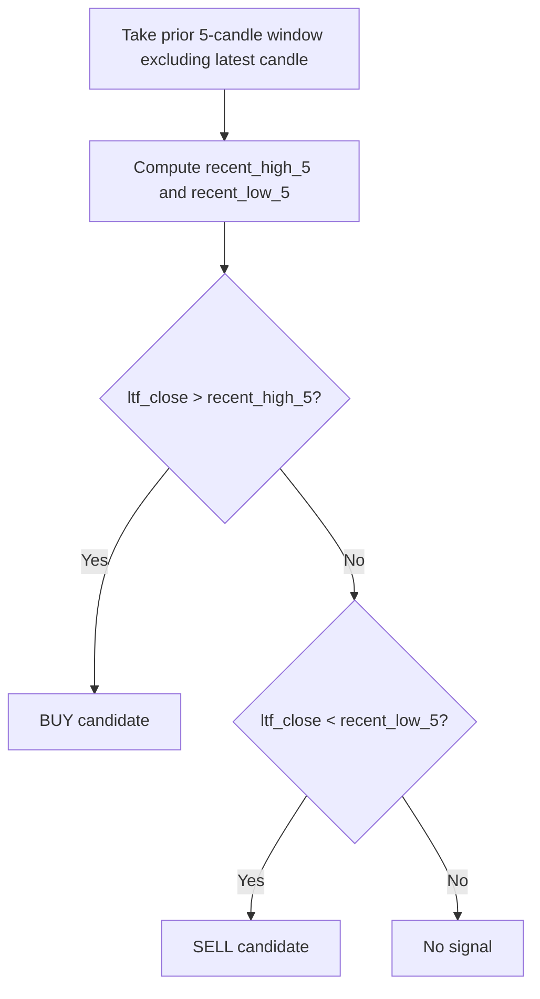
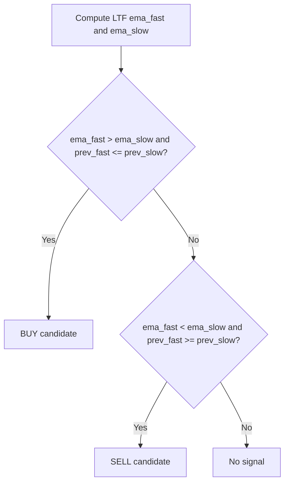
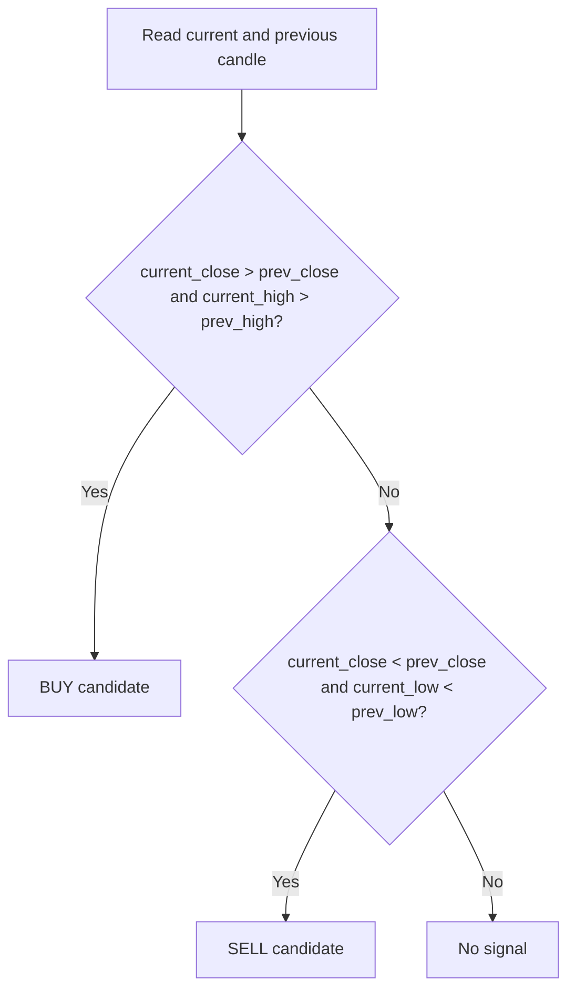
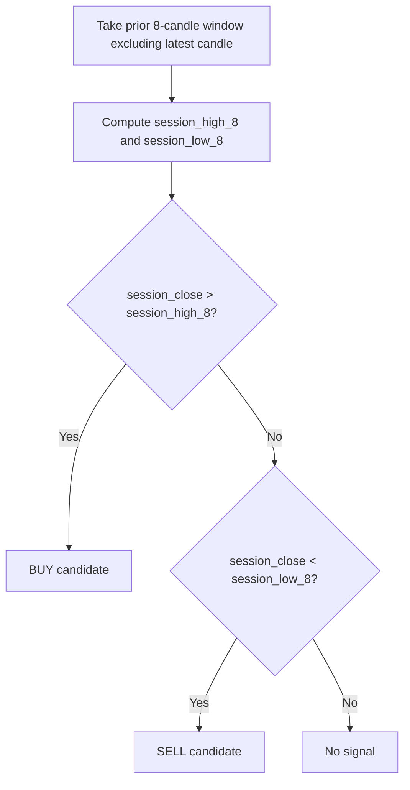

# Gold Bot Strategies

The gold bot packages five strategy ideas into one runner. Each strategy generates a directional signal and then the ladder builder can expand that signal into multiple entries.

Timeframe context:
- Strategy signals are generated from lower timeframe data and filtered by higher timeframe directional bias.
- Live mode uses cTrader LTF/HTF candles; backtest mode uses separate LTF/HTF CSV files.

## Decision Audit From Live Logs

Use this section to understand exactly why an entry candidate was picked.

Evaluation sequence per cycle:
1. Pull lower timeframe candles (LTF) and higher timeframe candles (HTF).
2. Compute HTF bias from HTF EMAs:
	 - buy when close >= ema_trend and ema_fast >= ema_slow
	 - sell when close <= ema_trend and ema_fast <= ema_slow
	 - neutral otherwise
3. Run each enabled LTF strategy and create candidates.
4. Remove candidates that conflict with non-neutral HTF bias.
5. Emit `📣 Signal detected ... decision_data={...}` for each surviving candidate.
6. Confirm/skip candidate based on trade mode and risk/cap gates.

Latest observed dry-run sample (M15/H1):
- HTF confirmation: bias=sell, close=4047.69, ema_fast=4056.77228, ema_slow=4058.83456, ema_trend=4052.17956
- Candidate 1 (price_action sell):
	- ltf_close=4038.85
	- recent_low_5=4042.29
	- result: 4038.85 < 4042.29, so sell candidate is valid
- Candidate 2 (session_breakout sell):
	- session_low_8=4042.29
	- session_close=4038.85
	- result: 4038.85 < 4042.29, so sell breakout candidate is valid
- HTF filter accepted both because both were sell and HTF bias was sell.

Decision flow:



## Multi-Strategy Execution Model

When you set multiple names in `GOLD_STRATEGY_NAMES`, the bot evaluates all enabled strategies on each cycle/candle.

Evaluation order:
1. `trend_following`
2. `price_action`
3. `scalping`
4. `news`
5. `session_breakout`

How signals are picked:
- There is no score/ranking between strategies.
- Every strategy that returns a candidate contributes to the candidate list.
- After candidates are collected, the higher-timeframe bias filter runs once and removes candidates that disagree with HTF direction.
- If HTF bias is neutral, no direction-based removal is applied.

How entries are made in current live/backtest services:
- Candidates are processed sequentially in the order above.
- Duplicate protection is per `symbol + strategy + direction + candle timestamp`, so the same strategy signal on the same candle is not re-sent.
- Different strategies on the same candle are allowed and are processed one by one.
- Each accepted candidate creates one order attempt (subject to caps/checks), not a ranked best-of-one selection.
- Live-mode gating checks then apply: daily trade cap, daily risk cap, max open positions, price availability, and broker execution response.

Important implementation note:
- Ladder expansion (`GOLD_ENABLE_MULTI_ENTRY`, `GOLD_LADDER_ENTRIES`) is used by the generic runner utility path.
- The current `GoldLiveService` and `GoldBacktestService` execution paths place one trade per accepted candidate and do not fan out into multiple live/backtest order entries per signal.

## Strategy overview

### 1. trend_following

How it works:
- Uses exponential moving averages to detect a trend and a pullback breakout.
- A buy signal appears when the latest close is above the long-term trend line and the fast EMA has just crossed above the slow EMA.
- A sell signal appears when the latest close is below the long-term trend line and the fast EMA has just crossed below the slow EMA.

Recommended use:
- Best for steady trend conditions and higher-confidence directional moves.
- Good default when you want a more conservative and explainable signal.

Suggested configuration:
- `GOLD_STRATEGY_NAMES=trend_following`
- `GOLD_EMA_FAST=9`
- `GOLD_EMA_SLOW=21`
- `GOLD_EMA_TREND_PERIOD=200`
- `GOLD_STOP_LOSS_PIPS=120`
- `GOLD_TAKE_PROFIT_PIPS=250`

Decision diagram:



Decision fields to inspect in logs:
- `decision_data.ema_fast`, `decision_data.ema_slow`
- `decision_data.ema_fast_prev`, `decision_data.ema_slow_prev`
- `decision_data.ema_trend`, `decision_data.ema_trend_prev`
- `decision_data.ltf_close`

### 2. price_action

How it works:
- Looks for price action rejecting a recent support or resistance level.
- A buy signal is generated when the latest price closes above its recent swing high after touching it.
- A sell signal is generated when the latest price closes below its recent swing low after touching it.

Recommended use:
- Good for range-based or momentum-driven environments.
- Useful when you want to react to structure rather than pure moving-average crossovers.

Suggested configuration:
- `GOLD_STRATEGY_NAMES=price_action`
- `GOLD_ENABLE_MULTI_ENTRY=true`
- `GOLD_LADDER_ENTRIES=2`
- `GOLD_STOP_LOSS_PIPS=80`
- `GOLD_TAKE_PROFIT_PIPS=180`

Decision diagram:



Decision fields to inspect in logs:
- `decision_data.window_bars` (5)
- `decision_data.recent_high_5`
- `decision_data.recent_low_5`
- `decision_data.ltf_close`

### 3. scalping

How it works:
- Uses a fast EMA crossover against a slower EMA.
- It reacts quickly to short-term momentum changes and is intended for tighter moves.

Recommended use:
- Best when you want faster, more frequent entries.
- Usually needs tighter risk and a smaller ladder so that the bot does not over-expose you.

Suggested configuration:
- `GOLD_STRATEGY_NAMES=scalping`
- `GOLD_LADDER_ENTRIES=1`
- `GOLD_STOP_LOSS_PIPS=40`
- `GOLD_TAKE_PROFIT_PIPS=90`
- `GOLD_RISK_PERCENT=0.5`

Decision diagram:



Decision fields to inspect in logs:
- `decision_data.ema_fast`, `decision_data.ema_slow`
- `decision_data.ema_fast_prev`, `decision_data.ema_slow_prev`
- `decision_data.ltf_close`

### 4. news

How it works:
- Looks for strong candle expansion after a spike or sharp recovery.
- It is meant to catch short-lived volatility bursts rather than long-term trend transitions.

Recommended use:
- Best for event-driven or high-volatility sessions.
- Works better when you keep risk conservative because these signals can reverse quickly.

Suggested configuration:
- `GOLD_STRATEGY_NAMES=news`
- `GOLD_STOP_LOSS_PIPS=60`
- `GOLD_TAKE_PROFIT_PIPS=140`

Decision diagram:



Decision fields to inspect in logs:
- `decision_data.prev_close`
- `decision_data.current_high`, `decision_data.prev_high`
- `decision_data.current_low`, `decision_data.prev_low`
- `decision_data.ltf_close`

### 5. session_breakout

How it works:
- Tracks the recent session high/low range and reacts when price breaks above or below it.
- Good for breakout-style trading when the market is trending or expanding.

Recommended use:
- Best during active trading sessions and when the market is expanding.
- Works well with session-hour filters.

Suggested configuration:
- `GOLD_STRATEGY_NAMES=session_breakout`
- `GOLD_STOP_LOSS_PIPS=100`
- `GOLD_TAKE_PROFIT_PIPS=220`

Decision diagram:



Decision fields to inspect in logs:
- `decision_data.window_bars` (8)
- `decision_data.session_high_8`
- `decision_data.session_low_8`
- `decision_data.session_close`

HTF confirmation fields (applies to all strategies):
- `decision_data.htf_confirmation.bias`
- `decision_data.htf_confirmation.close`
- `decision_data.htf_confirmation.ema_fast`
- `decision_data.htf_confirmation.ema_slow`
- `decision_data.htf_confirmation.ema_trend`

## Strategy presets

## Quick Backtest Matrix (6m vs 1m)

Source run:
- Script: `scripts/backtest_tf_matrix_eval.py`
- Output: `backtest/results/tf_matrix/tf_strategy_matrix_20260729_075525.csv`
- Mode: no plotting, quick-pass candle stride for faster comparative ranking.

### Comparative results

| Lookback | Strategy | LTF | HTF | Signals | Wins | Losses | Success rate |
| --- | --- | --- | --- | ---: | ---: | ---: | ---: |
| 6 months | trend_following | M15 | H1 | 75 | 35 | 40 | 46.67% |
| 6 months | price_action | M5 | M30 | 2317 | 1078 | 1235 | 46.61% |
| 6 months | scalping | M5 | M30 | 341 | 159 | 182 | 46.63% |
| 6 months | news | M5 | M30 | 6294 | 3084 | 3202 | 49.06% |
| 6 months | session_breakout | M15 | H1 | 634 | 310 | 324 | 48.90% |
| 1 month | trend_following | M15 | H1 | 17 | 7 | 10 | 41.18% |
| 1 month | price_action | M5 | M30 | 487 | 216 | 270 | 44.44% |
| 1 month | scalping | M5 | M30 | 87 | 42 | 45 | 48.28% |
| 1 month | news | M5 | M30 | 1463 | 706 | 754 | 48.36% |
| 1 month | session_breakout | M15 | H1 | 107 | 54 | 53 | 50.47% |

### Best setups from this run

- 6 months winner by success rate: `news` on `M5/M30` (49.06%).
- 1 month winner by success rate: `session_breakout` on `M15/H1` (50.47%).
- Most stable cross-window profile in this sample: `session_breakout` on `M15/H1` (48.90% over 6m and 50.47% over 1m).

### Practical recommendation

- Primary deployment candidate: `session_breakout` with `LTF=M15` and `HTF=H1`.
- Secondary high-activity candidate: `news` with `LTF=M5` and `HTF=M30`.
- For NYC session style alignment, prefer structure-led setups on `M15/H1` (price action and breakout context) and reserve `M5/M30` for higher-frequency momentum or event windows.

Notes:
- Balance change columns in quick-pass runs can be inflated by compounding and very high signal counts; use them as a relative indicator only.
- For promotion to live risk, re-run the top 2 setups with full-resolution candles (no stride) and fixed-risk assumptions.

### Trend preset

```env
ENABLE_TRADING=false
PLOT_ENABLED=true
SYMBOLS=XAUUSD
TIMEFRAME=M15
GOLD_STRATEGY_NAMES=trend_following
GOLD_ENABLE_MULTI_ENTRY=true
GOLD_LADDER_ENTRIES=3
GOLD_RISK_PERCENT=1.0
```

### Price-action preset

```env
ENABLE_TRADING=false
PLOT_ENABLED=true
SYMBOLS=XAUUSD
TIMEFRAME=M15
GOLD_STRATEGY_NAMES=price_action
GOLD_ENABLE_MULTI_ENTRY=true
GOLD_LADDER_ENTRIES=2
GOLD_STOP_LOSS_PIPS=80
GOLD_TAKE_PROFIT_PIPS=180
```

### Scalping preset

```env
ENABLE_TRADING=false
PLOT_ENABLED=true
SYMBOLS=XAUUSD
TIMEFRAME=M5
GOLD_STRATEGY_NAMES=scalping
GOLD_ENABLE_MULTI_ENTRY=false
GOLD_LADDER_ENTRIES=1
GOLD_RISK_PERCENT=0.5
```

### News preset

```env
ENABLE_TRADING=false
PLOT_ENABLED=true
SYMBOLS=XAUUSD
TIMEFRAME=M15
GOLD_STRATEGY_NAMES=news
GOLD_RISK_PERCENT=0.75
```

### Session-breakout preset

```env
ENABLE_TRADING=false
PLOT_ENABLED=true
SYMBOLS=XAUUSD
TIMEFRAME=M15
GOLD_STRATEGY_NAMES=session_breakout
GOLD_ENABLE_MULTI_ENTRY=true
```

## Configuration notes

- Use one primary strategy first before enabling all strategies at once.
- Increase risk gradually and only after a backtest is stable.
- Multi-entry is helpful for trend and breakout strategies; it usually hurts scalping performance if overused.
- Keep `PLOT_ENABLED=true` during calibration so you can inspect how the strategy behaves over time.
